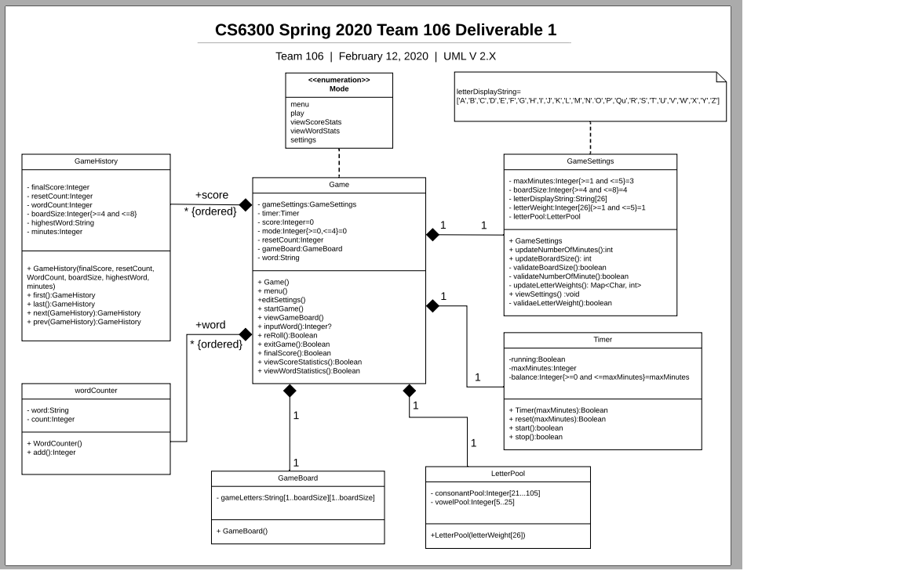

# 
CS6300 Spring 2020 &bull; Team 106 

# 
Deliverable #1

----------
# 
Design Discussion

----------

## Design 1
 
##
**tfatout3:** 

###### Pros)

&bull; UML: Additional level for main menu – good idea &bull; Design Explanation were good and clarified items that were not clear from class diagram 

**Cons)**

&bull; UML: BoardSetup, Statistics, and ReadWord have no members, only operations 
&bull; UML: Don’t see how game history is represented 
&bull; UML: Display of “Qu” - could be done in code, could be incorporated in data structure &bull; Design Explanation did not go far enough with regards to explaining some of the implementation concepts 
&bull; Design Explanation stops at Q5  
##
**cfakir3:** 

**Pros)**

&bull; Useful generating constants and vowels separately before checking for ratio &bull; I liked the use of display functions to trigger GUI 

**Cons)** 
&bull; App does not need word validation according to spec 
&bull; Confused about App class is it suppose to act like a main function? 
##
**kjoy7:** 

**Pros)**

&bull; Design looks simple.

**Cons)**

&bull; TimeOut attribute in Setting class has wrong datatype, should be int 
&bull; Statistic class could use attributes to store info for each Game. 
&bull; Could get rid of the ReadWord class and keep it as an operation in the WordGame Class 

----------

## Design 2
 
##
**tfatout3:** 

**Pros)**

 &bull; Design Explanation Description of Player class involvement good 

**Cons)**

&bull; UML: Crossed lines more difficult to read 
&bull; UML: Player class is interesting, but I think design should center on game and not player 
&bull; UML: Applies to all, word stats will need 2 maps, one keyed by word to update, and one ordered by count to display 
&bull; Design Explanation  would have answered req 3 requirements individually – better linkage &bull; Design Explanation  seems like all design documents weak on GUI description – do we need better? 
&bull;  Design Explanation - I do not quite follow the “list of lists” logic 
&bull; Design Explanation seems like intent is to do required reporting processing on demand (SortMap) instead of building a sorted data structure – this might improve response during gameplay while taking longer to display results (this may be desirable) 

##
**kjoy7:** 

**Pros)**

&bull; Good idea in using WordStatistics  & GameStatistics as the sub class of Statistics Class. 

**Cons)**

&bull; Player class is not required. No player information is stored. Methods Exit, Reroll etc are player actions and can  be on the methods on the WordGame class. 
&bull; Could have used Capitalized letter to start a Class name and small letter for operations.

##
**amorriset3:** 

**Pros)**
&bull; Like the use of utility for the timer. 

**Cons)**
&bull; List<char> Letters will not hold Qu

----------

## Design 3
 
##
**tfatout3:** 

**Pros)**

&bull; Design Explanation - good detail in implementation description 

**Cons)**

&bull; UML: Not sure why settings has statistics – wordgame should be able to read settings and update stats  

##
**cfakir3:** 

**Pros)**

&bull; I liked the idea of checking vowel percentage function as a way to validate vowel ratio. 

**Cons)**

&bull; Statistics relationship with game wrong, setting should be a collection of games  

##
**kjoy7:** 

**Cons)**

&bull; Relationships could have been made more clear. 
&bull; Square class is not necessary. 

##
**amorriset3:** 

**Pros)**
&bull; Like the methods that operate on settings in the settings class. 

**Cons)**
&bull; Don’t see a reroll method

----------

## Design 4
 
##
**tfatout3:** 

**Cons)**

&bull;  UML: Composition lines in wrong direction 
(Corrected document:  https://www.lucidchart.com/documents/view/7e38912-881d-494a-9b4b-5e140d8af7ec/0_0 
&bull; DE: Sloppy on item numbering – item numbers do not match up with requirements document 
## 
**cfakir3:** 

**Pros)**

&bull; I like the idea of a timer class that contains all useful functions  

**Cons)**

&bull; No indication of derived function for settings boardsize and minute  

##

**kjoy7:** 

**Pros)**

&bull; Good approach in centralizing the Game class and accessing every other class from the Game class.

&bull; Sperate Timer Class 

**Cons)**

&bull; Mode menu could be ENUM.

&bull; GameSettings class could have more operations 

##
**amorriset3:** 

**Pros)**

&bull; Lots of detail, Prefer your structure for letter weights. 

**Cons)**

&bull; Mode should be an enumeration in Java

&bull; Timer class is a built-in utility of Java 

Timer class is a built-in utility of Java 

##

### **Team Design**

 
##
The final design differs from cfakir3’s design in that it does not need a player class. It focuses purely on the game. The design is similar in that both utilize a class that makes up a collection of words to be inputted. The final design differs from amorrisett3’s design in that it uses an ordered collection of scores and words while amorrisett3’s has a 1 to 1 relationship. However, a similarity is the use of a class whose purpose is board generation. The final design differs from kjoy7’s design in that it has no direct relationships with any class besides the Game class making it simpler. Everything is utilized through that one class. However, a similarity is they both use enumeration in the design. We wanted a design that was simple in its relationships, involves defined collection of classes, and utilizes a diverse set of data structures like enumeration when useful. After discussing the details of each design, the team decided to use the tfatout3 design (Design 4) as a base. We then chose the following modifications:  
&bull; Correct the direction of the composition diamonds 
&bull; Change Mode note to an enumeration 
&bull; Add all the update and validation methods from kjoy7 design 
&bull; Move letter pool from Game class to GameSettings class 
&bull; Add viewGameboard method to Game class 
&bull; Update description 3-d-i (still use textbox, but return value will be word score or NULL) 
&bull; Update 3-d-ii to state that score will be reduced and gameboard will be reloaded 
&bull; Update 3-f update to read inputWord will return score of each word entered (correct inconsistent method names) 
&bull; Update 4-a to read "properties and methods" of GameSettings 
&bull; Add the following methods to the Game class - startGame, menu, editSettings 
&bull; Change type of gameLetters array in GameBoard class from Letter type to string  

## Summary
**tfatout3:** 
The team worked well together, and we were able to compare designs and discuss both similarities and differences. I felt that 2 of the designs (tfatout3 - Design 4 and kjoy7 - Design 3) were quite similar so presented the opinion that we should use one of those 2 designs as a base, which was accepted by the team. Once we decided on using tfatout3 (Design 4) for the base we made another pass through the other designs, extracting and incorporating the most desirable features. By the time we had our final design it also turned out that we had also discussed implementation ideas as well (although we really did not make any final decisions. We generated a list of action items which needed to be done to finish up the deliverable for the assignment which included a Wednesday afternoon initial draft upload, followed by a review period on Thursday and Friday, with final approval of content, commit id, and so forth scheduled for 10 pm PST Friday evening. We then agreed to each review the next deliverable on Saturday and determine time for a meet-up on Saturday using a private channel on Slack. 
##
**cfakir3:** 
After discussing the design and listing our pros and cons I discovered a new way of designing the application. A commonality between a few of my teammate's designs were to connect the multiple classes into game or app class. This class will create instances of all other classes and use them to complete the requirements in the spec. Our communication was great so any questions I had about this approach was answered promptly. I learned to appreciate the simplicity of such an approach. One big challenge was the time zone issue, EST and PST meant any time we met it was very early or very late for someone. Slack and email helped remedy this by allowing constant messaging between video conferences.  
##
**kjoy7:** 

There are different ways of thinking the same problem. All most all the designs had different approaches in attacking the same problem and the team collaboratively came up with a base design. I felt like we all respect each other and value others idea during the discussions. One challenge was to identify the best time to bring everybody around the project, but we were able to overcome it quickly. 

##
**amorriset3:** 

All of the designs were close enough to be able to complete the project however we needed to choose one so we decided on Tim's.  The group communicated friendly without hurting anyones feelings while we discussed the pros and cons of the designs. We spent a fair amount of time refining Tim's design to make sure it would best fit our situation in anticipation for being assigned a task of implemination.  We also took time to understand each others backgrounds in regaurds to development experience so that we know what talents we can expect to leverage for future tasks as well as what technologies were unknown to all of us with the anticipation that it will take more time to learn.  I look forward to working with the rest of the team on this project as they all seem capable and motivated.

     
----------

# 
Requirements 

##### 1. When the application is started, the player may choose to (1) Play a word game, (2) View statistics, or (3) Adjust the game settings. 

The Game class has a property named “mode”. This property will indicate the mode that the application is running in. If mode=0 the application will display a menu for user to select next activity. If the user selects game play mode is set to 1, 2 for view score stats, 3 for view word stats. 

##### 2. When choosing to adjust the game settings, the player (1) may choose for the game to end after a certain number of minutes, from 1 to 5, defaulting to 3, (2) may adjust the size of the square board, between 4(x4) and 8(x8), defaulting to 4, and (3) may adjust the weights of the letters of the alphabet between 1 and 5, defaulting to 1. 

The GameSettings class stores all these settings. When the Game application enters this mode (mode=4) the presentation layer will generate a screen  to display and modify this information.  

##### 3. When choosing to play a word game, a player will: 
##### a. Be shown a ‘board’ of randomly generated letters. 
The GameBoard class will be used to store the random letters. The presentation layer will use this data to display the “board”. An explanation of how the letters are generated can be found under requirement #4 
##### b. Be shown a timer counting down the number of minutes available for the game, as set in the settings. 
The Timer class will store the information pertaining to the timer and execute the appropriate operations. This class tracks how many minutes to run for, whether the timer is in a running state, and how much time is left. 
##### c. Start with 0 points, which is not required to be displayed during the game.> 
The game class has a property named “score” to store this value.** 
##### d. Until the game timer counts to zero and the game ends: 
##### &nbsp;&nbsp;&nbsp;&nbsp;&nbsp;i. Enter a unique word made up of two or more letters on the board. The word must contain only letters from the board that are each adjacent to the next (horizontally, vertically, or diagonally) and a single letter on the board may not be used twice.  The word does not need to be checked against a dictionary (for simplicity, we will assume the player enters only real words that are spelled correctly).</li> 
The Game class method inputWord will perform this function. The presentation layer will set focus to an input text box and the implementation will enforce the above input requirements. The property “word” will hold the input value while it is being processed. inputWord will return the computed word score or NULL if the timer has expired. 
##### &nbsp;&nbsp;&nbsp;&nbsp;&nbsp;&nbsp;&nbsp;&nbsp;&nbsp;&nbsp;or 
##### &nbsp;&nbsp;&nbsp;&nbsp;&nbsp;ii. Choose to re-roll the board at a cost of 5 points.  The board will be re-created in the same way it is generated at the start of each game, replacing each letter.  The timer will not be reset or paused.  The player’s score may go into negative values.  
The Game class has a method named “reRoll” that will execute this process. I envision this being an event handler that will be triggered by clicking a button displayed on the user interface. The handler will either perform or call appropriate methods to reduce the score of the current game by 5 points and re-initialize the game board with a new set of random words.  
##### &nbsp;&nbsp;&nbsp;&nbsp;&nbsp;&nbsp;&nbsp;&nbsp;&nbsp;&nbsp;or 
##### &nbsp;&nbsp;&nbsp;&nbsp;&nbsp;iii. Choose to exit the game early. 
The Game class has a method named “exitGame” that will execute this process. I envision this being an event handler that will be triggered by clicking a button displayed on the user interface. 
##### e. At the end of the game, when the timer has run out or the player chooses to exit, the final score for the game will be displayed. 
The Game class method “finalScore” will perform this process. Details on presentation layout and implementation details are not part of the class diagram.  
##### f. Each word will score 1 point per letter (‘Qu’ will count as 2 letters), and the cost for each board reset will be subtracted. 
While a description of the actual score calculation is not part of the class diagram, the Game class has the “score” property to store the score. The “inputWord” method will return the score of each score entered (or NULL if the timer has expired) while the “reRoll” method will reduce the score of the current game by 5 points. 
##### g. After the player views the score, they will continue back to the main menu. 
When the “finalScore” method of the game class get a close message from the user the “mode” property will be set to 0 and execution will continue from the main menu. 
##### 4. Whenever the board is generated, or re-generated it will meet the following criteria:  
##### a. The board will consist of a square full of letters.  The square should have the number of letters, both horizontally and vertically, indicated by the size of the square board from the game settings (4x4, 5x5, 6x6, 7x7, or 8x8).   
The GameBoard class will store this information. It is a discrete class so that it can be destroyed and re-created at different sizes as defined by properties and methods of the GameSettings class. While this could be done in the Game class whenever a member property is going to be destroyed and re-created, I think it is easier to understand it is a class. 
##### b. ⅕ (rounded up) of the letters will be vowels (a,e,i,o,u). ⅘ will be consonants. 
The LetterPool class will have two array members. One of them is to hold the pool of vowels, the other a pool of consonants. Separating the letters in this way allows voweld and consonants to be selected based on the above formula. 
##### c. The letter Q will be displayed as ‘Qu’ (so that Q never appears alone). 
The GameSettings class has a property named “letterDisplayString” that defined the string to display for each letter. Each letter will line up with an array value with A associated with the first value, b with the second value, and so on. Each array entry will hold the string representation of its corresponding letter except for Q, which will hold “Qu”. 
##### d. The location and particular letters should be randomly selected from a distribution of letters reflecting the weights of letters from the settings.  A letter with a weight of 5 should be 5 times as likely to be chosen as a letter with a weight of 1 (assuming both are consonants or both are vowels).  In this way, more common letters can be set to appear more often. 
The LetterPool class is designed to handle this. This class will hold as many copies of each letter as prescribed by its assigned weight. So a letter with weight 5 will have 5 copies of itself in the letter pool. Letters will be selected by generating a random number between 1 and the total number of letters in the pool. Since letters with greater weight appear more often in the pool their probability of being selected will be correctly increased. 
##### e. A letter may appear on the board more than once. 
While not described in the class diagram all letters will remain in the LetterPool for each selection, therefore the same letter can be selected multiple times. 
##### 5. When choosing to view statistics, the player may view (1) game score statistics, or (2) word statistics. 
The mode 0 menu interface of the Game class will display both options for the user to select. 
##### 6. For game score statistics, the player will view the list of scores, in descending order by final game score, displaying: 
##### &nbsp;&nbsp;&nbsp;&nbsp;&nbsp;a. The final game score
##### &nbsp;&nbsp;&nbsp;&nbsp;&nbsp;b. The number of times the board was reset
##### &nbsp;&nbsp;&nbsp;&nbsp;&nbsp;c. The number of words entered in the game
##### &nbsp;&nbsp;&nbsp;&nbsp;&nbsp;The player may select any of the game scores from this list to view the settings for that game’s board size, number of minutes, and the highest scoring word played in the game (if multiple words score an equal number of points, the first played will be displayed).  
The GameHistory class will maintain counters and history for the score, reset counts, boardsize, wordcount, highest scoring word, as well as any other data needed to drive this screen. The screen itself is not part of the class diagram, but the data structures needed to drive the screen are. 
##### 7. For the word statistics, the player will view the list of words used, starting from the most frequently played, displaying: 
##### i.  The word
##### ii. The number of times the word has been played, across all games</li> 
The wordCounter class will keep track of the number of occurrences for each word. To facilitate updating the count it will need to be ordered by word (perhaps a hash table) – while this structure could be process to display in order of descending frequency it is more likely the implementation will use maintain a second hash table using the same properties – except ordered by count instead of word. 
##### 8. The user interface must be intuitive and responsive.</li> 
This is a part of the presentation layer. I have planned the data structure assuming an event-driven model, which will result in good user response. 	
##### 9. The performance of the game should be such that students do not experience any considerable lag between their actions and the response of the application.</li> 
While some aspects of this are reliant on proper implementation the data structures have ben design to favor speed over space. Example would be ordering the wordCounter class by word to facilitate updating the word count when there are a lot of words. 	
##### 10. For simplicity, you may assume there is a single system running the application. 
While some aspects of this are reliant on proper implementation the data structures have ben design to favor speed over space. Example would be ordering the wordCounter class by word to facilitate updating the word count when there are a lot of words. 