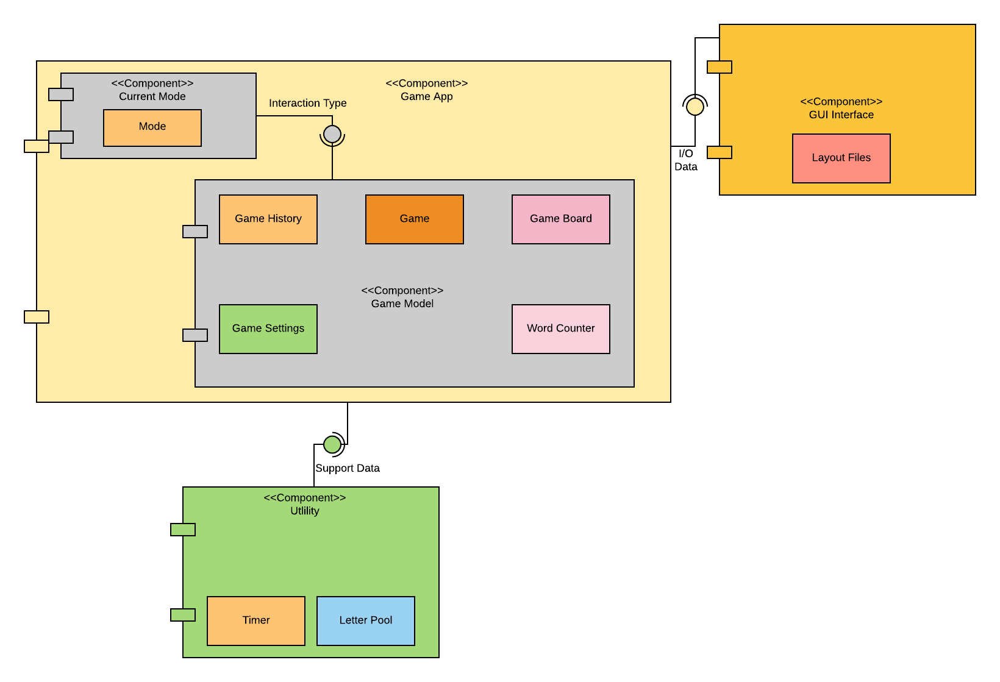
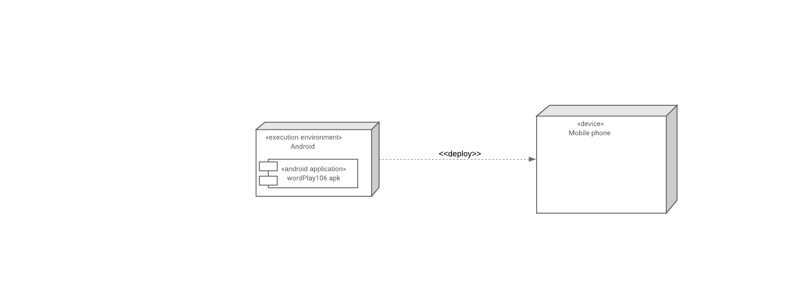
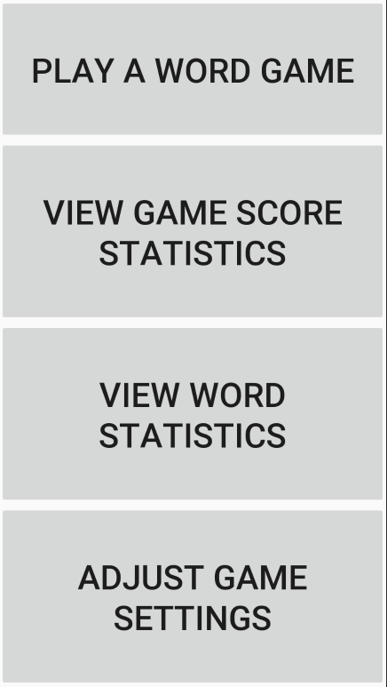
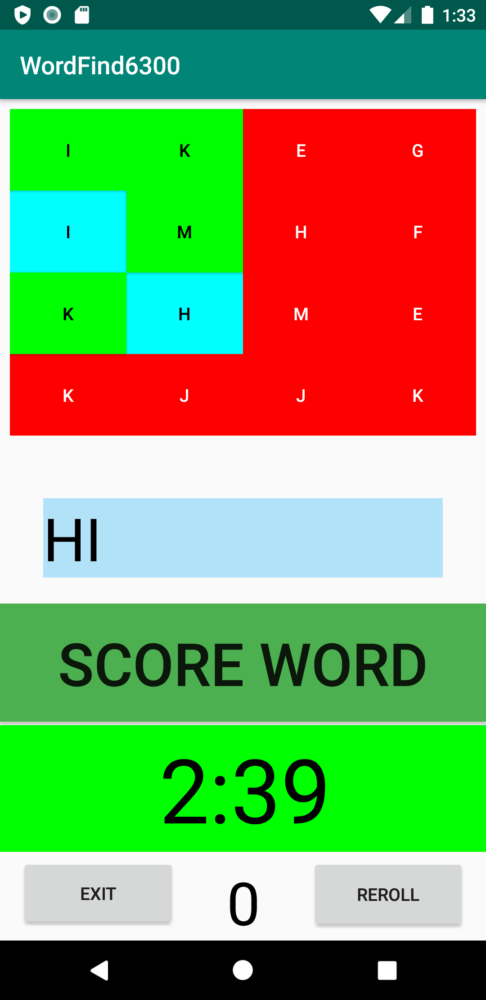
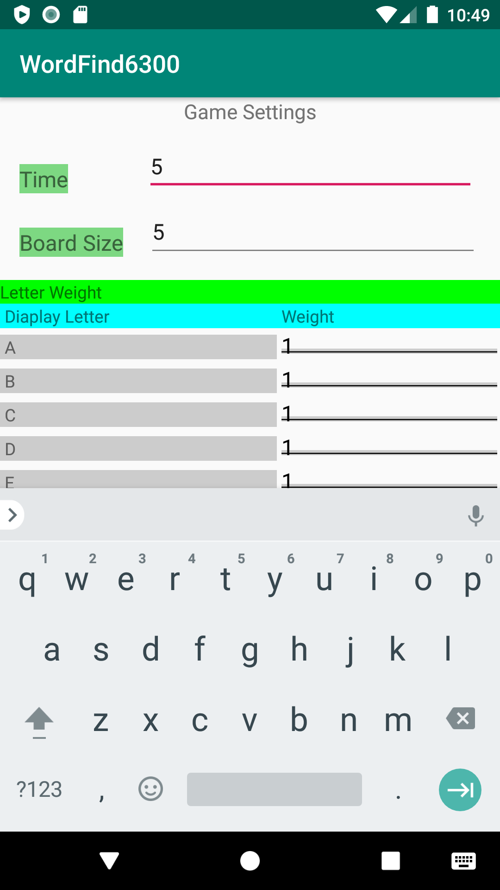
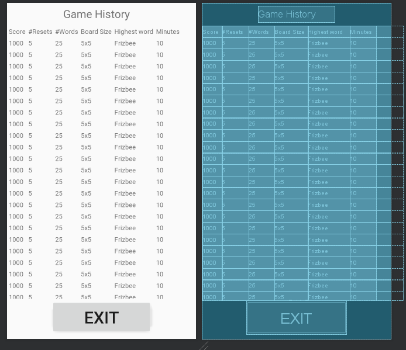
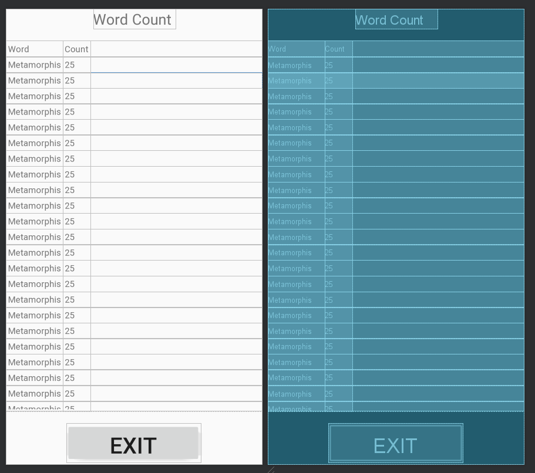

**Author**: Team106

**Version : 2.0** -  Updated User Interface design

**Version : 3.0** - Updated Class Diagram (version 2.0)

## 1 Design Considerations

### 1.1 Assumptions
The app will not store data past when the player exists, so a database is not required. The other assumption is that the player can understand English and/or describe non-English words with only ASCII letters. The player also has the drivers needed to operate a touch screen input game.    

### 1.2 Constraints
Because the system lacks a database, the memory is a constraint on how long the player can play the games.  The app relies on randomization of numbers to generate letter pools and so it relies on the underlying system's ability to produce randomness when given integers.
It also only uses ASCII characters.

### 1.3 System Environment
The software is created to run on an Android operating system. The device intent for the GUI is auto-sized so the app is mostly device independent. The only requirement is the device will need to have a touch screen. 
The device needs limited internet access, as most of the game operates on the device.  

## 2 Architectural Design

### 2.1 Component Diagram

### 2.2 Deployment Diagram

## 3 Low-Level Design

### 3.1 Class Diagram

  

## 4 User Interface Design
Menu prototype:

Game board prototype:

Settings prototype:

Game history prototype:

Word count prototype:

