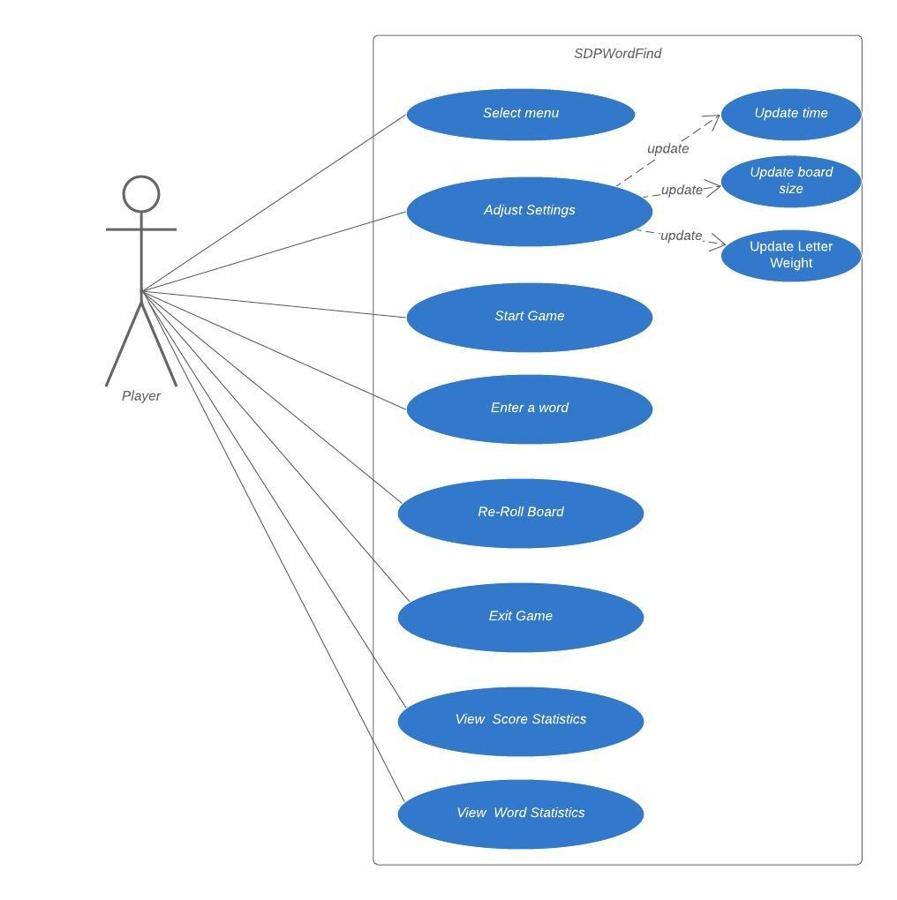
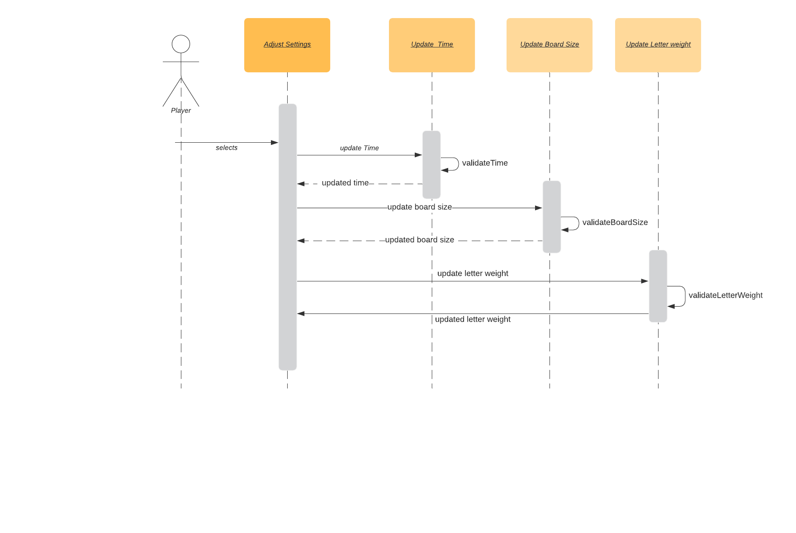

# Use Case Model

### **Author**: Team 106

## 1 Use Case Diagram

## 2  Use Case Descriptions

| USE CASE  #     | 1                                                            |
| --------------- | ------------------------------------------------------------ |
| Use Case Name   | Select Menu                                                  |
| Requirements    | Player can select menu option form the screen where they can select Edit Settings, Play Game, View Statistics |
| Pre-conditions  | Menu option is displayed                                     |
| Post-conditions | Player selects a menu option                                 |
| Scenarios       | -  The system displays menu with the following options - Settings, Play a Game, View Statistics  - Player choses an option from the menu - The system will display a screen based on the selected option |

| USE CASE  #     | 2                                                            |
| --------------- | ------------------------------------------------------------ |
| Use Case Name   | Adjust Settings                                              |
| Requirements    | Player can adjust the Games setting like Board size, Time and Letter Weight |
| Pre-conditions  | - Settings option should be selected from the Menu. - Time is set to 3 minutes by default - Board Size is displayed as 4 by default - Letter weight is set to 1 by default |
| Post-conditions | - Time entered should be between 1 and 5 minutes. - Board size should be between 4 and 8 - Letter Weight should be between 1 and 5 - Should pass all the validations |
| Scenarios       |  |

| USE CASE  #     | 3                                                            |
| --------------- | ------------------------------------------------------------ |
| Use Case Name   | Start Game                                                   |
| Requirements    | Player can select the Start a Game option from the menu on  the User Interface |
| Pre-conditions  | - Start  Game option is displayed.  - User Interface is populated with a 'board' with letters. - A count down timer is displayed |
| Post-conditions | - Timer should start counting down. - Player should be able to see a textbox where they can enter a word |
| Scenarios       | - Player selects the Start Game option from the menu. - User Interface will display a board with letters, size of the board will be the value the  Player sets in the Setting. - The generated letters will have 1/5th of the total letters with vowels and the rest with constants. - Letter 'Q' is displayed as 'Qu' on the board. - Letter with a higher weight is chosen more frequently than with a lower weight - Time is displayed and the start time should be shown starting with the time set in the settings. -Player will have an input field where they can enter a word using the letters from the board |

| USE CASE  #     | 4                                                            |
| --------------- | ------------------------------------------------------------ |
| Use Case Name   | Enter a Word                                                 |
| Requirements    | Player can enter a word in an input field on the Interface   |
| Pre-conditions  | - Input field is displayed                                   |
| Post-conditions | - All the validations should pass                            |
| Scenarios       | - Player enters a word on the input field. - Validate if the word entered is made up of more than one character.  - Validate if the letters in the word are adjacent to each other from the board.  - Validate a letter in the word is not repeated. - When all the validations are passed the point is added for the word, but not displayed. - Each letter in the word in of 1 point and letter 'Qu' is counted as 2 letters while calculating the score. |

| USE CASE  #     | 5                                                            |
| --------------- | ------------------------------------------------------------ |
| Use Case Name   | Re-Roll Board                                                |
| Requirements    | Re-Roll button is displayed on the User Interface            |
| Pre-conditions  | Re-Roll button is clicked                                    |
| Post-conditions | Letters on the Board should be recreated with a new set      |
| Scenarios       | - Player clicks the Re-Roll button. - 5 points are reduced from the score and the score can go negative. - Board is recreated. - Timer will keep running as the Re-roll has not impact on it.  |

| USE CASE  #     | 6                                                            |
| --------------- | ------------------------------------------------------------ |
| Use Case Name   | Exit Game                                                    |
| Requirements    | Player will have an option to exit out of the game by clicking an exit button. |
| Pre-conditions  | Exit Button is displayed                                     |
| Post-conditions | Player is taken back to the Main Menu screen                 |
| Scenarios       | - Player clicks Exit button. - Final score is displayed on the screen for the Player to view. - Redirect the player back to the Main Menu  |

| USE CASE  #     | 7                                                            |
| --------------- | ------------------------------------------------------------ |
| Use Case Name   | View Score Statistics                                        |
| Requirements    | Player can select the View Score Statistics option from the main menu, which will provide the statistics of the games the Player has played so far. |
| Pre-conditions  | View Score Statistics option is displayed on the menu        |
| Post-conditions | Player can view the details of old games                     |
| Scenarios       | - Player selects View Score Statistics option from the menu. - A list of all the scores are displayed on the UI as a link along with - final games score, Number of time the board was reset and the number of words entered during each game. - The order of the display list will be by descending order by the final game. -Player clicks a score from the list. - A new User Interface will open with the Settings of the selected game. - Player can see the board size, number of minutes and the highest scoring word for that game. |

| USE CASE  #     | 8                                                            |
| --------------- | ------------------------------------------------------------ |
| Use Case Name   | View Word Statistics                                         |
| Requirements    | Player can select the View Word Statistics option from the main menu, which will provide the statistics of the words the Player has used in all the games so far. |
| Pre-conditions  | View Word Statistics option is displayed on the menu         |
| Post-conditions | Player can view the words used so far in all the games       |
| Scenarios       | - Player selects View Word Statistics option from the menu. - A table will be displayed on the UI with the list of words used on all the games and the number of times the word was used.  - The order of the display ascending order by the number of time the word was used. |

